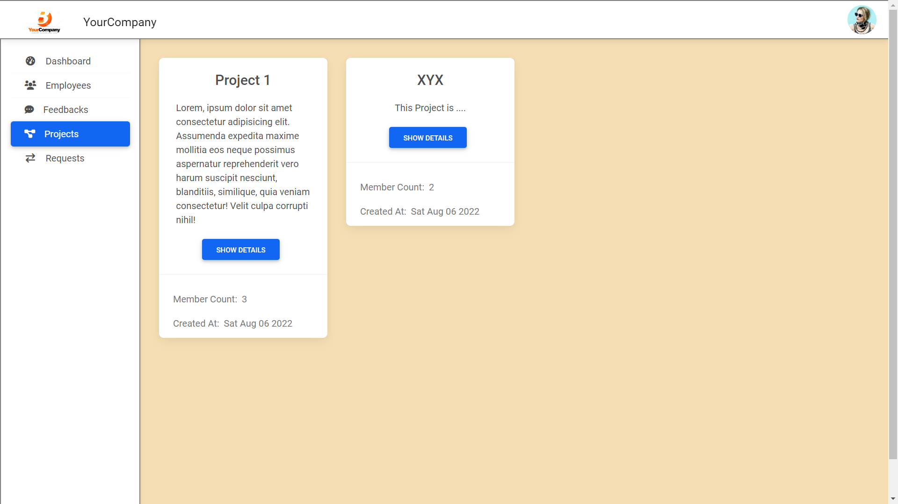
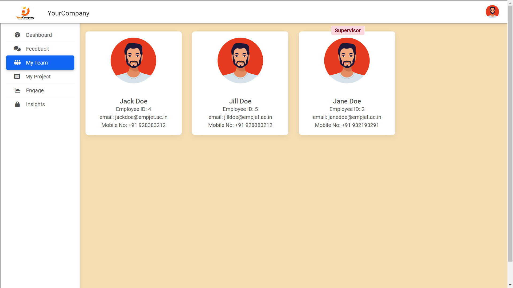

\*\*This project was developed by [Samarth Dengre](https://github.com/Samarth-Dengre) and - [Vaibhav Jaiswal](https://github.com/thecurious1-sudo) as a prototype for the event 'Code with Globalshala 3.0' and is not fully functional yet.

# Employee.Jet

This project is an Employee Engagement Platform. With the help of this project, A company can manage the workload of an employee, give tasks to the employee based on the skillset, take feedback about the project they are working on and about the team members, will improve the workplace experience by boosting employee morale, productivity, and company alignment

## Try it on your machine

This repository contains two sub projects. <br>1) [Employee.jet](https://github.com/thecurious1-sudo/Employee.jet) <br> 2) [Employee.jet_ADMIN ](https://github.com/Samarth-Dengre/Employee.jet_ADMIN)
<br>
`Employee.jet` contains the server for employees of the organization. It runs on port 3000.
`Employee.jet_ADMIN `contains the server for admin of the organization. It runs on port 4000.

In each of these folders, install the required dependencies by running

```bash
  npm install
```

and it will install all the required modules under `package.json`

Firstly you need to run `Employe.jet_ADMIN` server and run the index file present in `seeds` folder.
Simply execute these commands in the ADMIN server

```bash
  cd seeds
  node index.js
```

and then a Sample data will be seeded in your database. Now you are good to run both of the servers.
Make sure your Mongo server is running.
To use the website, run the below command in both `Employee.Jet_USER` and `Employee.Jet Admin`

```bash
node index.js
```

Now open any browser and type `localhost:4000` to run Admin server and `localhost:3000` to run employee server.

## Presentation

The presentation that got us into the second round of the event is included in this repo at root.

## Videos

There are 2 videos under `videos` folder which will demonstrate the basic usage of these 2 servers.

## Screenshots

- Admin View Of All Employees<br>  <br><br>
- Admin View Of All Projects<br> <br><br>
- Admin View Of All Feedbacks<br> <br><br>
- Employee View Of Their Project ToDo List<br> <br><br>
- Employee View Of Their Private ToDo List<br> <br><br>
- Employee View Of Their Team<br> <br><br>
- Employee View Of Feedbacks<br> <br><br>
- Employee View Of Filling Feedbacks<br> <br><br>
- Supervisor View Of Their Team<br> <br><br>
- Supervisor View Of Their Project<br> <br><br>
